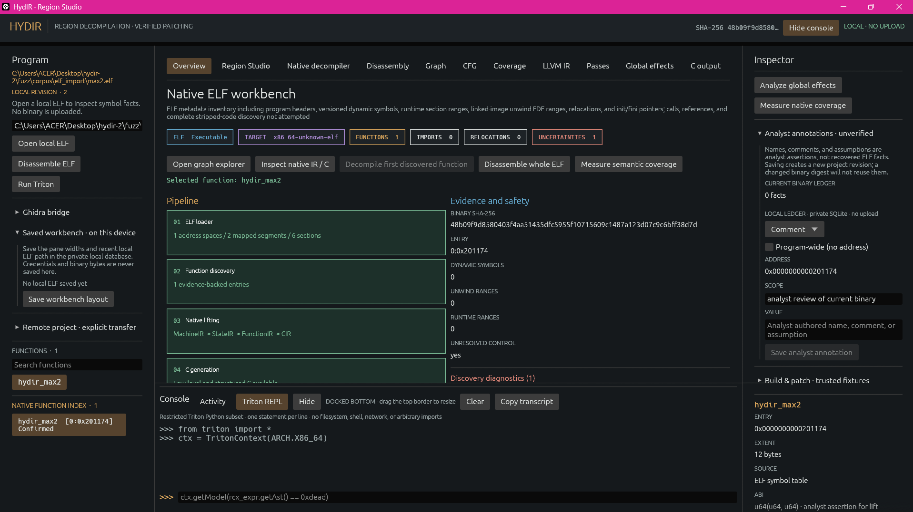
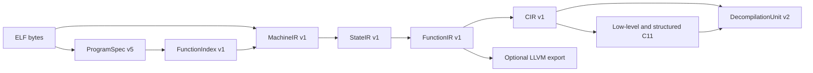
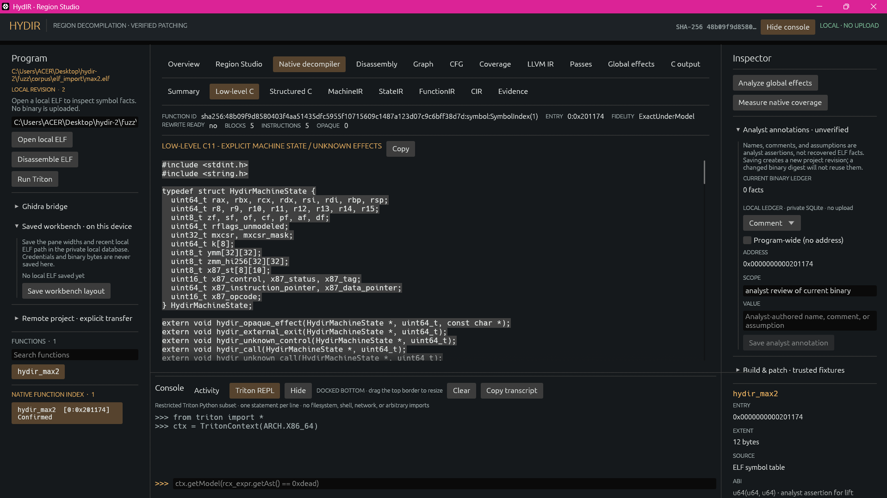
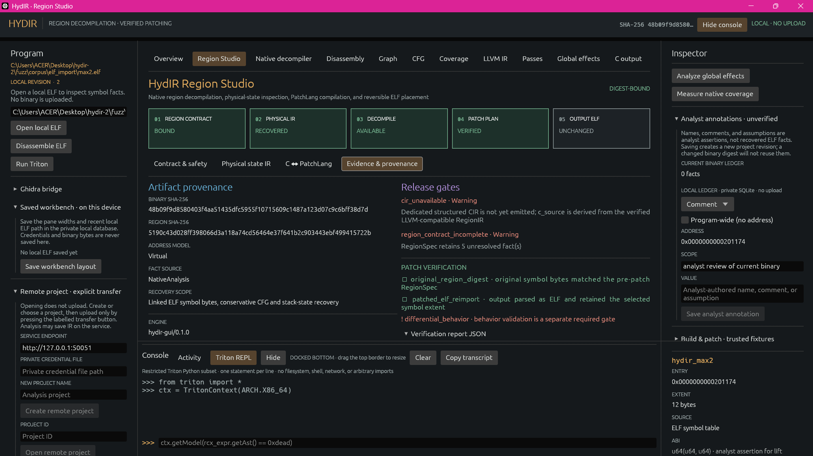
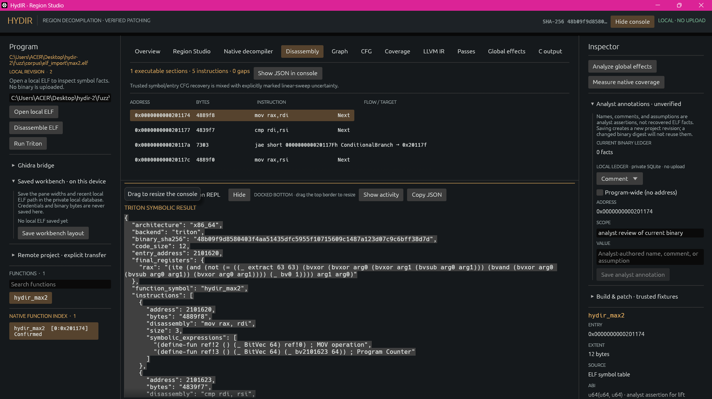

<h1 align="center">HydIR</h1>

<p align="center">
  <strong>Native x86-64 ELF analysis and bounded decompilation.</strong><br>
  Desktop workbench, command-line tools, Python SDK, and authenticated service.
</p>

<p align="center">
  <a href="https://hydir.wiki/">Documentation</a> ·
  <a href="#quick-start">Quick start</a> ·
  <a href="#native-elf-decompiler">Native decompiler</a> ·
  <a href="#native-analysis-workbench">Workbench</a> ·
  <a href="#verified-scalar-lift">Evidence</a> ·
  <a href="#analysis-transformation-and-rewrite-contracts">Operations</a> ·
  <a href="#symbolic-exploration-with-triton">Triton</a> ·
  <a href="#authenticated-service">Remote API</a>
</p>

[](assets/screenshots/hydir-elf-overview.png)

*The desktop workbench with a local ELF loaded: the overview presents the native analysis pipeline, program inventory, diagnostics, and inspector in one view.*

HydIR opens little-endian x86-64 ELF files locally, shows a function's bytes and
reachable branches, and turns supported semantics into inspectable LLVM IR and
C. The desktop app, CLI, Python SDK, and authenticated service share the native
core. The checked-in [`hydir_max2` walkthrough](https://hydir.wiki/articles/max2)
shows the path on a 16-byte function.

## Quick start

Use the checked-in ELF to open the desktop workbench or inspect the new native
decompiler stages. Run these commands from the repository root with Rust 1.96:

```bash
cargo run --locked --bin hydir -- --open-local fuzz/corpus/elf_import/max2.elf hydir_max2
cargo run --locked --bin hydirctl -- discover fuzz/corpus/elf_import/max2.elf
cargo run --locked --bin hydirctl -- lift fuzz/corpus/elf_import/max2.elf --function hydir_max2 --ir state
cargo run --locked --bin hydirctl -- decompile fuzz/corpus/elf_import/max2.elf --function hydir_max2 --view unit
```

Replace the ELF path and function selector with your own. `discover` returns
FunctionIndex IDs for entries without usable names. The GUI also opens an ELF
through its local file control. [Native CLI commands](docs/NATIVE_DECOMPILER.md#reproduction)
cover every IR stage, low-level and structured C, whole-file batch output,
coverage, and per-address explanations.

## Native ELF decompiler

The native path analyzes bounded, compiler-generated Linux x86-64 ELF files.
It does not execute the input or invoke Ghidra or another external decompiler.
Versioned intermediate artifacts retain the binary SHA-256, machine
locations, evidence, and uncertainties needed to inspect their output. The
[implementation record](docs/NATIVE_DECOMPILER.md) contains the full
instruction inventory and outstanding release gates.

### Pipeline and artifact contracts



| Stage | Contract and output |
| --- | --- |
| ELF import | `hydir-loader` creates a digest-bound `ProgramSpec` with file type, target and ABI, sections, mapped segments, program headers, symbols, imports, relocations, runtime ranges, and explicit recovery status. Linked files use process-image address space zero; relocatable sections have distinct address spaces. A PIE address is recorded without asserting its runtime load bias. |
| Discovery | `FunctionIndex` records an entry, stable ID, optional name, evidence state (`confirmed`, `probable`, or `ambiguous`), candidate extents, block entries, control targets, tail-call evidence, and unresolved conflicts. An index row is a candidate, not proof that every byte in its extent belongs to the function. |
| MachineIR | Recursive decoding records each instruction's address, original bytes, operands, decorators, register/flag/memory effects, and typed control edges. Relocated control operands use ELF relocation evidence rather than encoded linker placeholders. Unknown operations retain bounded `OpaqueEffect` footprints. |
| StateIR | Component-level SSA versions registers, modeled flags, control, and stack/image/TLS/heap/unknown memory regions. Predecessor versions and phis represent joins and loop backedges; a store consumes and defines its memory region. Architecturally undefined flags remain explicit outputs. |
| FunctionIR | Adds evidenced SysV AMD64 parameters and returns, calls, stack and global objects, pointer origins, alias sets, and diagnostics to the state flow. An inferred type or prototype is labeled with its evidence. |
| CIR and C | CIR preserves operations, opaque effects, and explicit terminators before emitting deterministic low-level C11. A separate structurer emits C for supported control shapes; remaining regions retain labels and gotos. LLVM is an optional FunctionIR export and is not the input to native C generation. |
| DecompilationUnit | Version 2 bundles C views, artifact digests, statement provenance, diagnostics, and independent structural, semantic, verification, and rewrite-readiness claims. Older ProgramSpec v1-v4 and DecompilationUnit v1 files are read through in-memory compatibility migrations; reading them does not upgrade their evidence. |

The native IRs distinguish `partial` from `complete` control-flow recovery,
`unknown`/`conservative` from `exact_under_model` semantics, and `not_run` from
static or differential verification. Exactness is relative to the recorded
machine and environment model; it is not a claim of whole-program equivalence.
The native path currently sets `rewrite_ready` to false, including when it can
emit C. Legacy scalar patch and rebuild operations require their own explicit
proofs and assertions.

### ELF loading and function discovery

The loader accepts linked executables, PIE/shared objects, stripped images,
and relocatable ELF objects. It inventories static and GNU-versioned dynamic
symbols; program headers; PLT, GOT, TLS, and unwind ranges; init/fini pointer
arrays; and relocations. Bounded `.eh_frame` CIE/FDE decoding contributes
function entry and extent evidence. Resolved init/fini pointers add probable
entries; unresolved pointers remain recorded. For relocatable objects,
section-relative identity and relocation-resolved control targets are retained.
Defined Itanium RTTI, type-info, vtable, construction-vtable, and VTT symbols
are recorded as bounded metadata ranges rather than promoted to recovered
source types.

Discovery combines symbol, ELF entry, unwind, direct-call, decoded PLT-stub,
init/fini, and Go 1.18+ `.gopclntab` evidence. Rust, C++, and Go symbol
spellings are retained as language evidence without inferring a source-level
signature from a name alone. Standard PLT slots can receive imported names
when relocation order supports the match. Candidate branch targets and
possible terminal-branch tail calls stay separate from confirmed call facts.
Recursive block recovery stops at known entries or its size bound. Absolute
pointer tables and relocation-backed relative tables can add indirect CFG
targets; recovery iterates when a newly reached block exposes another table.
An unresolved switch default or indirect destination remains visible.

The implementation bounds ELF input to 64 MiB, an extracted function to
64 KiB, and a function decode to 16,384 instructions. Discovery retains at
most 16,384 candidate entries. Explicit `discover` enriches block membership
for at most 256 candidates under an 8 MiB decode budget; interactive selection
can decode a chosen candidate lazily. Exceeding a bound produces a diagnostic
or explicit refusal rather than silently treating omitted bytes as analyzed.

### Instruction and state semantics

| Family | Modeled behavior and boundary |
| --- | --- |
| Scalar integer and control | Width-aware moves, extension, arithmetic, ADC/SBB, comparisons, conditional moves and sets, LEA, shifts/rotates including BMI2 forms, bit counts/scans/tests, multiplication, and signed/unsigned divide normal paths. Partial registers, PF/AF/DF, and undefined results or flags have explicit state effects. Divide errors retain exception edges. |
| Stack, strings, and calls | Common stack operations and DF-aware MOVS/STOS/CMPS/SCAS with REP variants update implicit registers and flags. Direct, indirect, and tail-call evidence is retained. REP results remain conservative where interruption or fault-time partial progress is unresolved. |
| SIMD and floating point | Alias-aware XMM/YMM/ZMM state; supported SSE/AVX/AVX2 moves, integer lanes, shuffles, broadcasts, AESENC, scalar/packed arithmetic, conversions, and comparisons; selected AVX-512 bitwise, packed-floating, move, mask, permutation, popcount, GFNI, qword comparison, and compression forms. MXCSR-aware helpers model normal paths with explicit unresolved exception edges. Aligned accesses retain alignment-fault edges; masked memory accesses touch only active elements. Unsupported EVEX decorators remain conservative. |
| Atomics and ordering | Supported LOCK arithmetic, exchange, compare-exchange (including 8/16-byte forms), bit modification, and LFENCE/SFENCE/MFENCE use bounded helper contracts. Other atomic forms retain a conservative memory and register footprint. |
| x87 and extended state | Common 80-bit stack arithmetic, comparisons, conversions, transcendental operations, and environment/state-image save/restore use explicit x87 registers and control/status/tag state. FXSAVE/FXRSTOR and MXCSR transfers have a bounded legacy image. Dynamic XSAVE/XRSTOR-family layouts retain request-mask, XCR0/XSS, memory-direction, state, and exception effects without inventing component offsets. |
| System and environment | CPUID, time counters, XCR access, and hardware randomness have bounded environment-helper effects; analysis does not execute them. Linux `syscall` remains opaque but records ABI inputs, clobbers, unknown-memory effects, and control flow so wrapper analysis can continue. |

For an unsupported instruction, the decoder retains its bytes, address,
known architectural read/write footprint, and a diagnostic. The unknown
behavior is carried through subsequent IRs and emitted as a visible helper
call in low-level C. This allows a compilable diagnostic view without
claiming that the function's behavior was recovered exactly.

### ABI recovery and C generation

FunctionIR starts with SysV AMD64 register and stack locations. It recovers
integer and evidenced pointer inputs, XMM/YMM inputs, RAX:RDX and vector
returns, and scalar or packed floating types only when evidence is unique.
Audited version-aware libc, POSIX, pthread, and loader prototypes can supply
fixed argument/result locations, variadic markers, and `noreturn` facts for
external calls. Unknown indirect targets, aliases, and call effects remain
conservative. Entry-RSP stack normalization handles common frame-pointer and
frame-pointer-omitted prologues; accesses stay raw where a join or dynamic
stack change prevents a proof.

Low-level C11 uses explicit machine state, memory helpers, labels, and
opaque-effect helpers. The structured view handles straight-line code,
nested acyclic `if`/`else`, guarded jump-table `switch`, and proven pre-tested
or post-tested single-loop shapes. Other reducible or irreducible control flow
keeps explicit labels and gotos. A structured view is optional; if unavailable,
`--view structured` reports that condition while `--view low` and `--view unit`
remain available. C compilation establishes syntax and type consistency for
the helper contract; it does not establish behavioral equivalence.

[](assets/screenshots/hydir-low-level-c.png)

*The Low-level C view displays generated helper contracts alongside the artifact's fidelity and rewrite-readiness claims. The displayed C is an inspectable analysis output, not a verified replacement for the input function.*

### Native CLI and evidence

The local CLI exposes the intermediate stages and reports directly:

```bash
cargo run --locked --bin hydirctl -- lift program.elf --function symbol --ir machine
cargo run --locked --bin hydirctl -- lift program.elf --function symbol --ir function
cargo run --locked --bin hydirctl -- lift program.elf --function symbol --ir cir
cargo run --locked --bin hydirctl -- lift program.elf --function symbol --ir llvm
cargo run --locked --bin hydirctl -- decompile program.elf --function symbol --view low
cargo run --locked --bin hydirctl -- decompile program.elf --function symbol --view structured
cargo run --locked --bin hydirctl -- coverage program.elf
cargo run --locked --bin hydirctl -- explain program.elf --function symbol --address 0x401000
cargo run --locked --bin hydirctl -- decompile-all program.elf --output-dir new-output-directory
```

`--function` accepts an unambiguous name or a FunctionIndex ID. `explain`
reports recovered instruction effects and diagnostics, optionally narrowed to
one address. `coverage` counts exact and opaque instruction occurrences by
family and includes bounded opaque-site samples. `decompile-all` requires a
new output directory and refuses to merge with or overwrite an existing one.

On the pinned stripped Go fixture, a whole-file pass lifted 1,481 pclntab
functions with 116,592 exact and 37 opaque instruction occurrences (99.968%
exact for that fixture). All 1,481 low-level C views and 165 structured views
strict-compiled to objects. This is fixture evidence, not a broad-corpus or
differential-correctness result. On Linux x86-64,
`bash scripts/demo-native-decompiler.sh` checks discovery, deterministic batch
emission, and strict C compilation. Dedicated native-pipeline and IR JSON
fuzz targets check crashes and refusals; a manual/weekly real-ELF stress
workflow exercises the stripped Go fixture. See the
[remaining gates](docs/NATIVE_DECOMPILER.md#remaining-gated-work).

## Native analysis workbench

The `hydir` desktop application presents the program tree, analysis panes,
inspector, and diagnostics in one workbench. Open an ELF with the local file
control or `--open-local <elf> [function-symbol]`. Local opening reads the file
on the host; transfer to an authenticated service requires the separate,
explicit upload action.

The program tree includes symbolized and anonymous FunctionIndex entries.
Selecting one reveals its entry and extent evidence, reachable disassembly,
machine bytes, CFG, and available native MachineIR, StateIR, FunctionIR, CIR,
low-level C, structured C, and diagnostics. The workbench also exposes the
legacy scalar LLVM/C path, named pass experiments, and conservative global
effects. Linear-sweep candidates, undecodable gaps, and unresolved branches
remain marked as uncertain instead of becoming confirmed functions.

Local names, comments, and assumptions are analyst facts with a scope and
binary identity; they do not become machine-derived evidence. A private SQLite
store retains these facts, pane widths, and the recent local path. It does not
persist credentials, binary bytes, or a remote session. Remote artifacts are
checked against their project revision and digest before presentation. Local
and remote pass, rebuild, and scalar-patch controls use the same bounded
contracts as the CLI and write new output paths.

### GUI screenshots

The overview at the top of this README shows the loaded ELF and native pipeline
status. The following captures show individual analysis views of the desktop
application.

**Disassembly.** Recovered instructions retain their addresses, original
machine bytes, and decoded operations.

[](assets/screenshots/egui-disassembly.webp)

**Function inspector.** The selected function's entry, byte extent, ELF symbol
source, asserted ABI, and reachable CFG size appear beside the analysis views.

[](assets/screenshots/egui-inspector.webp)

**C output and diagnostics.** The GUI reports an unsupported call explicitly
while retaining the independently recovered CFG and LLVM lift.

[](assets/screenshots/egui-refusal.webp)

Remote projects do not reconnect automatically. Plaintext service connections
remain loopback-only; non-loopback connections require TLS.

## Verified scalar lift

The earlier scalar lift is a separate, narrower path for explicitly asserted
`u64(u64,u64)` functions. Its checked-in demos emit LLVM IR and C for 20
distinct scalar fixtures, run the LLVM verifier where the required tools are
available, and compare output with native execution on 1,008 input pairs.

```bash
bash scripts/demo-local.sh
bash scripts/demo-corpus.sh
```

The bounded scalar contract now also covers proven balanced frames, initialized
nonoverlapping 32/64-bit stack locals (including the SysV leaf red zone),
32-bit arithmetic/comparisons with explicit flags, `mov` zero-extension, and
RIP-relative address formation, plus direct calls to uniquely bounded scalar
leaf symbols. Other memory, unresolved calls, and unmodelled aliases remain
explicit refusals.

RegionSpec v3 CFG recovery is a separate structural stage. It requires decoded
external edges to match the declared continuation exits exactly, records direct
call targets with a distinct edge kind, and does not promote imported liveness
or stack facts into semantic proof. MachineIR preserves mapped/TLS memory and
non-frame register-save effects, while the scalar lift refuses them until a
physical-state and memory contract is available.
Imported call-site `stop`/`noreturn` facts are kept distinct, source-attributed,
and may suppress a region fallthrough only at their exact instruction address.

The scripts retain CFG, LLVM IR, C, and comparison reports. Their finite
fixture results do not establish equivalence for arbitrary programs. A C
generation refusal also does not discard an independently recovered CFG or
LLVM lift; the workbench presents each stage's status separately.

## Analysis, transformation, and rewrite contracts

The following operations are separate from native decompilation. Each has its
own supported input subset, output artifact, and acceptance conditions.

| Operation | Input and result | Required boundary |
| --- | --- | --- |
| Global effects | `analyze` and `analyze-spec` recover bounded direct-call and mapped-global read/write evidence, with provenance in the report and ProgramSpec. Unresolved calls or memory effects remain conservative. | This is a partial interprocedural analysis, not a complete call graph or alias proof. |
| LLVM pass experiment | The legacy scalar lift is passed to LLVM 14 with a sequence of at most four unique names from `instcombine`, `sccp`, `simplifycfg`, and `dce`. The operation saves raw, canonical-before, after, report, and digest evidence. | Requires an asserted scalar prototype and trusted fixture; LLVM verification does not establish equivalent behavior. Remote experiments create a new immutable revision while retaining the original ELF bytes. |
| Scalar patch | A versioned JSON document binds the source ELF SHA-256, sized `.text` symbol, asserted `u64(u64,u64)` prototype, and C-like return expression. Compilation checks the original scalar lift, region bytes, exits, stack restoration, interior-entry evidence, and relocations. A `PatchBundle` records typed PatchIR, byte differences, placement, hashes, and structural verification. | Requires explicit trusted-fixture, prototype, and entry-only assertions. A fitting replacement is written in place within a new ELF copy; a larger supported replacement uses an entry jump into a new executable segment. Neither path overwrites the original or claims behavioral verification. |
| Whole-executable rebuild | The separate freestanding path lifts a static ELF with sized `_start` and complete, non-overlapping `.text` symbol coverage into stateful LLVM IR, then links a bounded read/write/exit runtime. It emits a new ELF, IR, and report. | Requires direct control flow, supported instructions, definite state initialization, and a bounded data image. Stack accesses, indirect edges, and unsupported syscalls are refused. This worker is not an arbitrary-binary sandbox. |

[](assets/screenshots/hydir-region-provenance.png)

*Region Studio keeps source provenance, patch verification checks, release-gate warnings, and analyst annotations visible with the selected region. Warnings identify unmet conditions; they do not constitute approval to rewrite the binary.*

The scalar patch document has this minimal form; the digest must match the
input ELF exactly:

```json
{
  "schema_version": 1,
  "binary_sha256": "<64 lowercase hexadecimal characters>",
  "function_symbol": "hydir_max2",
  "prototype": "u64(u64,u64)",
  "replacement": "return arg0 - arg1;"
}
```

For local operations, the corresponding commands are:

```bash
cargo run --locked --bin hydirctl -- analyze program.elf
cargo run --locked --bin hydirctl -- analyze-spec program.elf
cargo run --locked --bin hydirctl -- transform program.elf symbol --assume-u64x2 --trusted-fixture --passes instcombine,sccp --output-dir new-pass-directory
cargo run --locked --bin hydirctl -- patch program.elf patch.json --trusted-fixture --assume-u64x2 --assume-entry-only --output patched.elf
cargo run --locked --bin hydirctl -- rebuild program.elf --trusted-fixture --output-dir new-rebuild-directory
```

The patch output is a separate ELF and can be reverted using its matching
bundle when the recorded byte and hash checks pass. Remote mutations require
the current project revision and an idempotency key; the service does not
execute the result.

## HydIR interchange and region contracts

HydIR owns its protobuf contracts under the `hydir.interchange` and
`hydir.patch` namespaces. The interchange importer retains the original
protobuf bytes for lossless forwarding, including fields unknown to the
decoded view. Decoding limits the document to 64 MiB, 8,192 functions,
65,536 blocks, 4,096 memory ranges, 65,536 symbols and call sites each,
4,096-byte names, and a type nesting depth of 64; individual value and type
graphs have separate node budgets. The streaming convention uses bounded
2,000,000-byte chunks. A decoded specification is bound to matching ELF bytes
before a selected block can become RegionSpec v3:

```bash
cargo run --locked --bin hydirctl -- hydir-spec-inspect program.proto
cargo run --locked --bin hydirctl -- hydir-spec-region \
  program.proto program.elf 26 --output region.json
cargo run --locked --bin hydirctl -- hydir-spec-lift \
  program.proto program.elf 26 --output physical-region-ir.json
cargo run --locked --bin hydirctl -- hydir-spec-decompile \
  program.proto program.elf 35 --output decompilation-unit.json
cargo run --locked --bin hydirctl -- hydir-spec-report \
  program.proto program.elf
```

`hydir-spec-inspect` validates the bounded document; `hydir-spec-region`
constructs the selected CFG contract; `hydir-spec-lift` emits
`PhysicalRegionIR` v1; `hydir-spec-decompile` requests a unit only where its
proof obligations hold; and `hydir-spec-report` summarizes compatibility.
`PhysicalRegionIR` v1 covers every instruction in the pinned 23-region corpus.
It records typed operations and operands, exact successors, register/flag and
memory effects, physical boundary locations, stack deltas, unresolved facts,
and byte/digest provenance. Decoding alone does not imply lowering or
replacement safety. The narrower structured-decision form binds imported flag
inputs, both exact continuations, and unchanged live outputs before emitting
LLVM-compatible text and deterministic C.

The local server mounts the interchange and patch services and accepts the
bounded streaming convention. For non-empty programs it currently returns a
precondition error where physical adapters are incomplete; it does not
fabricate C or PatchIR. The pinned external reference repository is a
test-only submodule and is not linked into HydIR:

```bash
git submodule update --init third_party/hydir-reference
```

The current compatibility boundary is recorded in
[ADR 0018](docs/adr/0018-native-compatibility-boundary.md). The native
decompiler's remaining gates are listed in the
[implementation record](docs/NATIVE_DECOMPILER.md#remaining-gated-work).

## Symbolic exploration with Triton

The optional Triton bridge explores direct paths in a selected x86-64
function and reports symbolic expressions, path conditions, and candidate
models. It requires a Python interpreter with Triton installed. `doctor`
checks whether the configured interpreter can import it.

```bash
export HYDIR_TRITON_PYTHON=/path/to/python-with-triton
cargo run --locked --bin hydirctl -- doctor
cargo run --locked --bin hydirctl -- triton /path/to/program.elf function_name
```

In the workbench, **Run Triton** operates on the selected function. The bottom
console accepts a restricted statement set, one entry at a time. The
[Triton walkthrough](https://hydir.wiki/articles/triton-api) gives an
instruction-level example. Triton exploration is separate from the LLVM and
native C paths; explored paths do not establish whole-program equivalence.

[](assets/screenshots/hydir-disassembly-triton.png)

*The disassembly view places decoded instructions beside a docked Triton result, so the selected function and its symbolic exploration can be inspected together.*

## Authenticated service

`hydird` stores revisioned projects and provides explicit ELF upload,
inspection, CFG and global-effect analysis, scalar lift/C artifacts, named
pass experiments, annotations, restricted rebuild/patch operations, and
durable jobs. The mounted `hydir.v1` and `hydir.v2` services retain existing
operations. `hydir.v3` adds native program-analysis jobs and per-stage artifact
retrieval. The remote CLI covers the established v1/v2 commands; the
[Python SDK](sdk/python/README.md) negotiates v3, then v2 or v1 when a newer
service is unavailable. The service never executes uploaded binaries.

```bash
# Create an identity once; save the one-time credential in a private 0600 file.
cargo run --locked --bin hydird -- identity create /path/to/hydird.sqlite analyst

# Start the service in a separate terminal.
cargo run --locked --bin hydird -- serve /path/to/hydird.sqlite 127.0.0.1:50051

# Point the CLI at the service and the saved credential.
export HYDIR_ENDPOINT=http://127.0.0.1:50051
export HYDIR_TOKEN_FILE=/private/path/analyst.token
cargo run --locked --bin hydirctl -- remote discover
cargo run --locked --bin hydirctl -- remote create demo unique-request-key
cargo run --locked --bin hydirctl -- remote upload <project-id> <expected-revision> /path/to/program.elf
```

### Project and native-analysis lifecycle

Project creation returns an ID and revision. Upload is the explicit transfer
boundary and creates a new immutable binary revision. Subsequent reads and
mutations supply the expected revision so an artifact cannot silently be
associated with a different ELF. The v3 native interface has these operations:

| Operation | Contract |
| --- | --- |
| `Discover` | Reports API version and the supported ProgramSpec, FunctionIndex, IR, and DecompilationUnit schema versions. |
| `StartProgramAnalysis` | Starts an isolated analysis job for a project revision. An idempotency key identifies retries of the same request; the job records its project and revision. |
| `GetAnalysisJob`, `CancelAnalysisJob`, `StreamAnalysisEvents` | Read status, request cancellation, or replay sequenced events from an `after_sequence` cursor. |
| `GetProgramArtifact` | Retrieves `program_spec`, `function_index`, or `coverage` for the program, or `machine`, `state`, `function`, `cir`, `llvm`, or `unit` for a FunctionIndex ID or unambiguous name. Each response includes bytes, media type, SHA-256, and project revision. |
| `UpdateAnalystFact` | Appends a revision-checked, idempotent name, comment, or assumption with analyst provenance. A fact does not become an ELF-derived proof. |

The Python SDK checks returned revision, content digest, media type, and JSON
schema version before exposing a native artifact. Its
`get_program_artifact(...)` method requires a selector for function-scoped
stages and rejects one for program-scoped stages. The remote CLI currently
provides the established v1/v2 operations; use the SDK or v3 gRPC contract
for these native methods. See the [SDK reference](sdk/python/README.md) and
[v3 schema](crates/hydir-api/proto/hydir_v3.proto).

### Authorization and transport

Projects use ordered `viewer`, `analyst`, `operator`, and `admin` roles. Existing
owners migrate to `admin`; new projects create their owner ACL atomically.
Administrative access changes are offline database-owner operations and append
an audit event:

```bash
cargo run --locked --bin hydird -- identity create /path/to/hydird.sqlite reviewer
cargo run --locked --bin hydird -- access grant /path/to/hydird.sqlite <project-id> analyst reviewer viewer
cargo run --locked --bin hydird -- access list /path/to/hydird.sqlite <project-id> analyst
cargo run --locked --bin hydird -- access revoke /path/to/hydird.sqlite <project-id> analyst reviewer
```

Roles are checked per operation. Analysts can start v3 analysis, retrieve v3
artifacts, and append analyst facts; operators can mutate binaries, and admins
can manage project access. The project owner cannot be downgraded or removed.

Plaintext service mode is restricted to loopback. The additive `serve-tls`
mode accepts non-loopback connections through TLS. Certificate and key paths
must be absolute, the key must be private on Unix, and clients validate the
certificate against configured trust roots:

```bash
cargo run --locked --bin hydird -- serve-tls /path/to/hydird.sqlite 0.0.0.0:50051 /run/secrets/tls.crt /run/secrets/tls.key
export HYDIR_ENDPOINT=https://hydir.example:50051
```

`serve-oidc` replaces static-token authentication with a pinned RS256 JWKS while
retaining mandatory TLS. Tokens must carry a matching issuer and audience plus
valid `exp`, optional `nbf`, and non-empty `sub` claims. The JWKS path is
absolute and bounded; unknown keys or algorithms fail closed:

```bash
cargo run --locked --bin hydird -- serve-oidc \
  /path/to/hydird.sqlite 0.0.0.0:50051 \
  /run/secrets/tls.crt /run/secrets/tls.key \
  https://identity.example/tenant hydir-api /run/config/oidc-jwks.json
export HYDIR_ENDPOINT=https://hydir.example:50051
export HYDIR_TOKEN_FILE=/private/path/access.jwt
```

OIDC subjects are registered as deterministic opaque HydIR principals on first
successful authentication. A database operator can resolve those principals
for ACL administration with `hydird identity list-oidc <database.sqlite>`.

### Content storage

The additive content-storage migration keeps existing inline SQLite objects
readable and allows new binary/artifact payloads to be written to a verified,
content-addressed filesystem store. Metadata remains revisioned in SQLite;
each read rechecks both the recorded size and SHA-256 digest. The object root
must be an absolute real directory and must not be group/world writable on
Unix:

```bash
cargo run --locked --bin hydird -- serve-oidc-cas \
  /path/to/hydird.sqlite 0.0.0.0:50051 \
  /run/secrets/tls.crt /run/secrets/tls.key \
  https://identity.example/tenant hydir-api /run/config/oidc-jwks.json \
  /var/lib/hydir/objects
```

Filesystem objects are written through same-directory temporary files and an
atomic rename. A failed database transaction can leave an unreferenced object,
which is harmless in the immutable CAS and may be reclaimed by future storage
maintenance tooling. Back up the SQLite database and object root together.

`serve-oidc-s3` stores the same digest-derived immutable keys in AWS S3 or an
S3-compatible HTTPS service. It uses the standard AWS credential provider
chain, streams reads through a 64 MiB hard bound, and verifies SHA-256 after
every read. Pass `-` for the AWS-managed endpoint and/or an empty object prefix;
custom endpoints must be origin-only HTTPS URLs:

```bash
cargo run --locked --bin hydird -- serve-oidc-s3 \
  /path/to/hydird.sqlite 0.0.0.0:50051 \
  /run/secrets/tls.crt /run/secrets/tls.key \
  https://identity.example/tenant hydir-api /run/config/oidc-jwks.json \
  - us-east-1 hydir-artifacts production
```

HydIR records only the S3 key, backend kind, digest, and size in metadata. It
never stores cloud credentials in the project database or command line.

### Deployment boundary

The TLS/OIDC/SQLite/filesystem-CAS mode is a secure deployment foundation, not
the completed production profile. Automatic discovery/key refresh, PostgreSQL,
quotas, audit export, and Kubernetes packaging remain required before that
profile is release-ready.

Upload is never implicit: the last command is the transfer boundary. Use the project ID and revision returned by the preceding commands for subsequent `remote inspect`, `cfg`, `lift`, `decompile`, `artifact`, or `job-*` operations. Credential files must not be group- or world-readable.

## Documentation site

The [HydIR wiki](https://hydir.wiki/) is a static site in `blog/`. To preview it
locally with the same clean URLs used on Vercel, run
`python scripts/serve-wiki-site.py` and open `http://127.0.0.1:8765/`.
Run `python scripts/check-wiki-site.py` to check its routes and assets.

## License

HydIR is released under the [GNU Affero General Public License v3.0 only](LICENSE).
