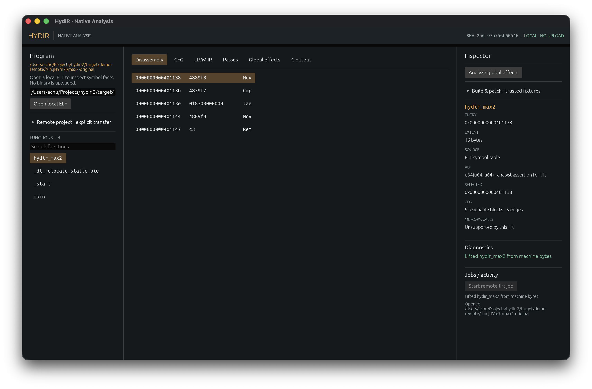
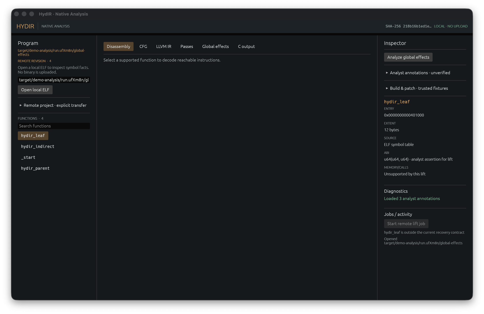

<h1 align="center">HydIR</h1>

<p align="center">
  <strong>A native workbench for inspecting, lifting, testing, and rebuilding a bounded x86-64 ELF subset.</strong><br>
  Local by default, explicit about uncertainty, and designed around inspectable artifacts.
</p>

<p align="center">
  <a href="#quick-start">Quick start</a> ·
  <a href="#native-analysis-workbench">Workbench</a> ·
  <a href="#verified-scalar-lift">Evidence</a> ·
  <a href="#capability-map">Capabilities</a>
</p>

[](assets/screenshots/studio-disassembly.png)

HydIR opens little-endian x86-64 ELF files without uploading them. The current native slice recovers bounded control flow, emits LLVM IR and scalar C for a deliberately small instruction set, runs differential checks against trusted fixtures, and exposes the same core through a desktop app, CLI, Python SDK, and authenticated loopback service.

This is an engineering workbench, not a general decompiler. Unsupported instructions, memory behavior, calls, partial registers, and ambiguous recovery paths stop the lift instead of being guessed.

## Quick start

Rust 1.96 is pinned in [`rust-toolchain.toml`](rust-toolchain.toml), and [`Cargo.lock`](Cargo.lock) fixes the Rust dependency graph.

```bash
cargo test --locked --workspace
cargo run --locked --bin hydir
```

Open a local binary directly:

```bash
cargo run --locked --bin hydir -- \
  --open-local /path/to/program.elf function_name
```

Or inspect it from the CLI:

```bash
cargo run --locked --bin hydirctl -- inspect /path/to/program.elf
cargo run --locked --bin hydirctl -- cfg /path/to/program.elf function_name
cargo run --locked --bin hydirctl -- lift \
  /path/to/program.elf function_name \
  --assume-u64x2 --output lifted.ll
```

Clang with x86-64 ELF and LLVM IR support is required for the full demo path. Native execution comparisons require Linux x86-64. On macOS with Docker Desktop:

```bash
bash scripts/demo-linux-docker.sh
```

## Native analysis workbench

[](assets/screenshots/studio-analyst-annotations.png)

The desktop workbench keeps the program tree, analysis views, inspector, and diagnostics visible at once. It can:

- disassemble executable sections with recursive recovery from symbols and entry points
- show uncertain linear-sweep regions and undecodable gaps instead of silently promoting them to functions
- inspect CFG, LLVM IR, scalar C, named pass results, and conservative global effects
- save local names, comments, assumptions, and pane layout in a private SQLite project
- create an authenticated loopback project only through an explicit transfer action
- apply bounded transforms, rebuilds, and scalar patches to new output paths

Opening a local ELF does not upload it. Credentials are not persisted, remote projects do not reconnect automatically, and the service refuses non-loopback binding.

## Verified scalar lift

The checked demo path covers 20 distinct scalar functions. Each function is lifted to LLVM IR and C, verified where the required LLVM tools are available, then compared with native execution on 1,008 inputs per output path.

```bash
bash scripts/demo-local.sh
bash scripts/demo-corpus.sh
```

The egui workbench exposes the selected function's decoded instructions and scope. The demo scripts record CFG, LLVM IR, C, and differential results as inspectable artifacts. These checks establish the documented subset only; they do not prove equivalence for arbitrary programs.

<p align="center">
  
  
</p>

## Capability map

| Surface | Current scope | Entry point |
|---|---|---|
| Desktop | Local ELF inspection, projects, annotations, CFG, lift, C, passes, effects, patch and rebuild flows | `cargo run --bin hydir` |
| CLI | Local inspection plus authenticated loopback operations | `hydirctl` |
| Native lift | Bounded scalar x86-64 function subset | `hydirctl lift` |
| Scalar C | Conservative C for the same accepted function contract | `hydirctl decompile` |
| Whole rebuild | Trusted static freestanding fixtures with bounded memory and syscall support | `hydirctl rebuild` |
| Scalar patch | Entry-only whole-function replacement with explicit assertions | `hydirctl patch` |
| Python | Typed client for the authenticated loopback subset | [`sdk/python`](sdk/python/README.md) |
| Symbolic bridge | Bounded x86-64 function expressions and a restricted REPL | `hydirctl triton` |

Useful end-to-end demos:

```bash
bash scripts/demo-password-showcase.sh
bash scripts/demo-analysis.sh
bash scripts/demo-passes.sh
bash scripts/demo-recompile.sh
bash scripts/demo-patch.sh
bash scripts/demo-remote.sh
```

Each script creates a fresh run directory under `target/` and keeps reports beside the generated artifacts.

## License

HydIR is released under the [GNU Affero General Public License v3.0 only](LICENSE).
