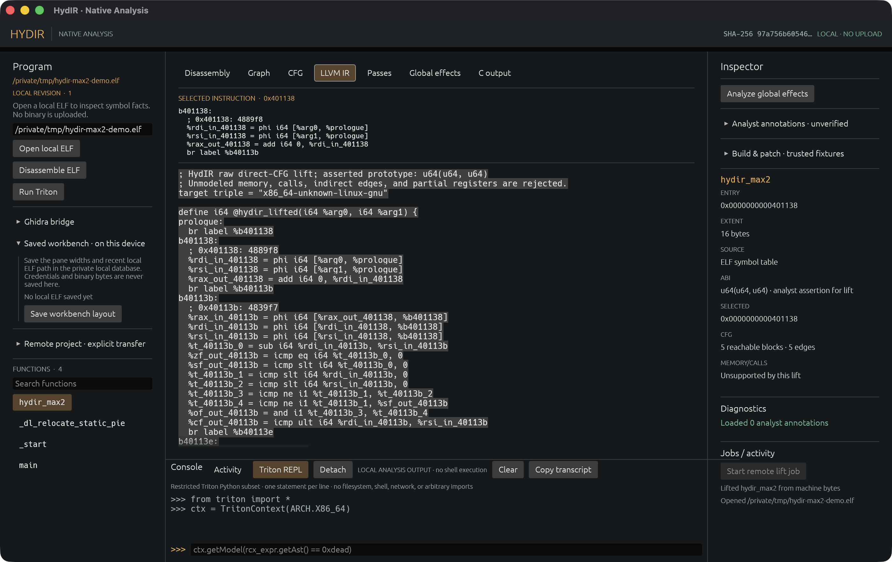
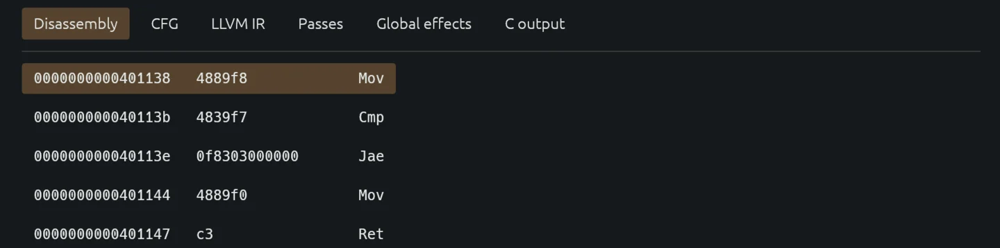
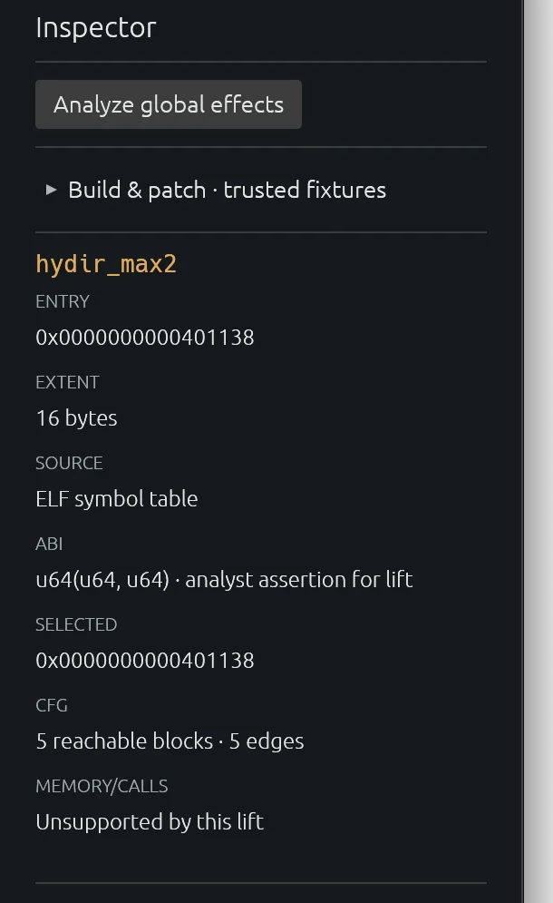
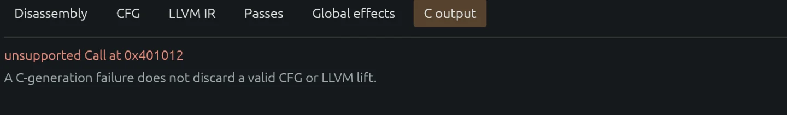

<h1 align="center">HydIR</h1>

<p align="center">
  <strong>A native workbench for inspecting, lifting, testing, and rebuilding a bounded x86-64 ELF subset.</strong><br>
  Local by default, explicit about uncertainty, and designed around inspectable artifacts.
</p>

<p align="center">
  <a href="#quick-start">Quick start</a> ·
  <a href="#native-analysis-workbench">Workbench</a> ·
  <a href="#verified-scalar-lift">Evidence</a> ·
  <a href="#symbolic-exploration-with-triton">Triton</a> ·
  <a href="#authenticated-loopback-service">Remote API</a>
</p>

[](assets/screenshots/studio-lift.png)

*The native egui workbench analyzing `hydir_max2`: local ELF, machine-byte-derived LLVM IR, and the selected function's scope in one view.*

HydIR opens little-endian x86-64 ELF files without uploading them. The current native slice recovers bounded control flow, emits LLVM IR and scalar C for a deliberately small instruction set, runs differential checks against trusted fixtures, and exposes the same core through a desktop app, CLI, Python SDK, and authenticated loopback service.

This is an engineering workbench, not a general decompiler. Unsupported instructions, memory behavior, unresolved calls, unmodelled partial registers, and ambiguous recovery paths stop the lift instead of being guessed.

## Quick start

Rust 1.96 is pinned in [`rust-toolchain.toml`](rust-toolchain.toml), and [`Cargo.lock`](Cargo.lock) fixes the Rust dependency graph.

```bash
cargo test --locked --workspace
cargo run --locked --bin hydir
```

Open a local binary directly:

```bash
cargo run --locked --bin hydir -- \
  --open-local /path/to/program.elf function_name
```

Or inspect it from the CLI:

```bash
cargo run --locked --bin hydirctl -- inspect /path/to/program.elf
cargo run --locked --bin hydirctl -- disassemble /path/to/program.elf
cargo run --locked --bin hydirctl -- cfg /path/to/program.elf function_name
cargo run --locked --bin hydirctl -- region /path/to/program.elf function_name
cargo run --locked --bin hydirctl -- lift \
  /path/to/program.elf function_name \
  --assume-u64x2 --output lifted.ll
cargo run --locked --bin hydirctl -- decompile \
  /path/to/program.elf function_name \
  --assume-u64x2 --output lifted.c
```

The [semantic evidence gate](SEMANTIC_GATE.md) records supported cases,
explicit refusals, and semantic mismatches. The [HydIR compatibility report](HYDIR_COMPATIBILITY.md)
defines the pinned reference experiment, while [MIRRORBALL_STUDY.md](MIRRORBALL_STUDY.md)
tracks recovery-boundary evidence.

Clang with x86-64 ELF and LLVM IR support is required for the full demo path. Native execution comparisons require Linux x86-64. On macOS with Docker Desktop:

```bash
bash scripts/demo-linux-docker.sh
```

## Native analysis workbench

The desktop workbench keeps the program tree, analysis views, inspector, and diagnostics visible at once. It can:

- disassemble executable sections with recursive recovery from symbols and entry points
- show uncertain linear-sweep regions and undecodable gaps instead of silently promoting them to functions
- inspect CFG, LLVM IR, scalar C, named pass results, and conservative global effects
- save local names, comments, assumptions, and pane layout in a private SQLite project
- create an authenticated loopback project only through an explicit transfer action
- apply bounded transforms, rebuilds, and scalar patches to new output paths

The disassembly view ties each recovered instruction to its address and bytes. Branches and unsupported regions remain inspectable instead of being silently turned into source code.

[](assets/screenshots/egui-disassembly.webp)

Selecting a function fills the inspector with its entry, extent, source, asserted ABI, and recovered CFG scope. These are facts and explicit assumptions about the selected function, not a guessed prototype.

<p align="center"></p>

Opening a local ELF does not upload it. Credentials are not persisted, remote projects do not reconnect automatically, and the service refuses non-loopback binding.

## Verified scalar lift

The checked demo path covers 20 distinct scalar functions. Each function is lifted to LLVM IR and C, verified where the required LLVM tools are available, then compared with native execution on 1,008 inputs per output path.

```bash
bash scripts/demo-local.sh
bash scripts/demo-corpus.sh
```

The bounded scalar contract now also covers proven balanced frames, initialized
nonoverlapping 32/64-bit stack locals (including the SysV leaf red zone),
32-bit arithmetic/comparisons with explicit flags, `mov` zero-extension, and
RIP-relative address formation, plus direct calls to uniquely bounded scalar
leaf symbols. Other memory, unresolved calls, and unmodelled aliases remain
explicit refusals.

RegionSpec v3 CFG recovery is a separate structural stage. It requires decoded
external edges to match the declared continuation exits exactly, records direct
call targets with a distinct edge kind, and does not promote imported liveness
or stack facts into semantic proof. MachineIR preserves mapped/TLS memory and
non-frame register-save effects, while the scalar lift refuses them until a
physical-state and memory contract is available.
Imported call-site `stop`/`noreturn` facts are kept distinct, source-attributed,
and may suppress a region fallthrough only at their exact instruction address.

The scripts record CFG, LLVM IR, C, and differential results as inspectable artifacts. These checks establish the documented subset only; they do not prove equivalence for arbitrary programs. The UI also keeps failures specific: an unsupported call can stop C generation without invalidating an already recovered CFG or LLVM lift.

[](assets/screenshots/egui-refusal.webp)

## HydIR interchange checkpoint

HydIR owns its protobuf contracts under the `hydir.interchange` and
`hydir.patch` namespaces. Specifications are decoded under explicit inventory,
nesting, value, chunk, and total-size limits; the original bytes are retained
for lossless forwarding. A specification can be bound to its matching ELF and
converted block-by-block into RegionSpec v3:

```bash
cargo run --locked --bin hydirctl -- hydir-spec-inspect program.proto
cargo run --locked --bin hydirctl -- hydir-spec-region \
  program.proto program.elf 26 --output region.json
cargo run --locked --bin hydirctl -- hydir-spec-decompile \
  program.proto program.elf 35 --output decompilation-unit.json
cargo run --locked --bin hydirctl -- hydir-spec-report \
  program.proto program.elf
```

The first typed native RegionIR form covers side-effect-free conditional
regions. It binds imported physical flag inputs, both exact continuation
addresses, and every live output through an explicit pass-through mapping. Its
LLVM-compatible text and deterministic C use aggregate results rather than an
invented scalar function ABI; other region shapes continue to fail closed.

The local server mounts both HydIR services and accepts the bounded streaming
chunk convention. For non-empty programs it currently returns a fail-closed
precondition error instead of fabricating C or PatchIR while physical adapters
remain incomplete. The pinned external reference repository is a test-only
submodule and is not linked into HydIR:

```bash
git submodule update --init third_party/hydir-reference
```

Measured compatibility and remaining semantic blockers are recorded in
[HYDIR_COMPATIBILITY.md](HYDIR_COMPATIBILITY.md).

## Symbolic exploration with Triton

The optional Triton bridge explores bounded direct-control-flow paths inside one selected x86-64 function and returns symbolic expressions. It is separate from the LLVM lift and does not establish whole-program equivalence. Use a Python interpreter with the Triton bindings available; `doctor` reports whether HydIR can import them.

```bash
export HYDIR_TRITON_PYTHON=/path/to/python-with-triton
cargo run --locked --bin hydirctl -- doctor
cargo run --locked --bin hydirctl -- triton /path/to/program.elf function_name
```

In egui, select a function and use **Run Triton**. The bottom console accepts a restricted, one-statement-at-a-time Python-shaped subset for inspecting bounded registers, expressions, and models; it is not a general Python shell.

## Authenticated loopback service

`hydird` provides revisioned projects, explicit ELF upload, inspection, CFG and global-effect analysis, lift and scalar C artifacts, named pass experiments, annotations, bounded rebuild/patch operations, and durable lift jobs with events and cancellation. It preserves `hydir.v1` and adds `hydir.v2` region, DecompilationUnit, PatchBundle compile/apply, and structural verification operations. The CLI and [Python SDK](sdk/python/README.md) use the same authenticated API. The service does not execute uploaded binaries and will not bind to a non-loopback address.

```bash
# Create an identity once; save the one-time credential in a private 0600 file.
cargo run --locked --bin hydird -- identity create /path/to/hydird.sqlite analyst

# Start the service in a separate terminal.
cargo run --locked --bin hydird -- serve /path/to/hydird.sqlite 127.0.0.1:50051

# Point the CLI at the service and the saved credential.
export HYDIR_ENDPOINT=http://127.0.0.1:50051
export HYDIR_TOKEN_FILE=/private/path/analyst.token
cargo run --locked --bin hydirctl -- remote discover
cargo run --locked --bin hydirctl -- remote create demo unique-request-key
cargo run --locked --bin hydirctl -- remote upload <project-id> <expected-revision> /path/to/program.elf
```

Upload is never implicit: the last command is the transfer boundary. Use the project ID and revision returned by the preceding commands for subsequent `remote inspect`, `cfg`, `lift`, `decompile`, `artifact`, or `job-*` operations. Credential files must not be group- or world-readable.

## License

HydIR is released under the [GNU Affero General Public License v3.0 only](LICENSE).
