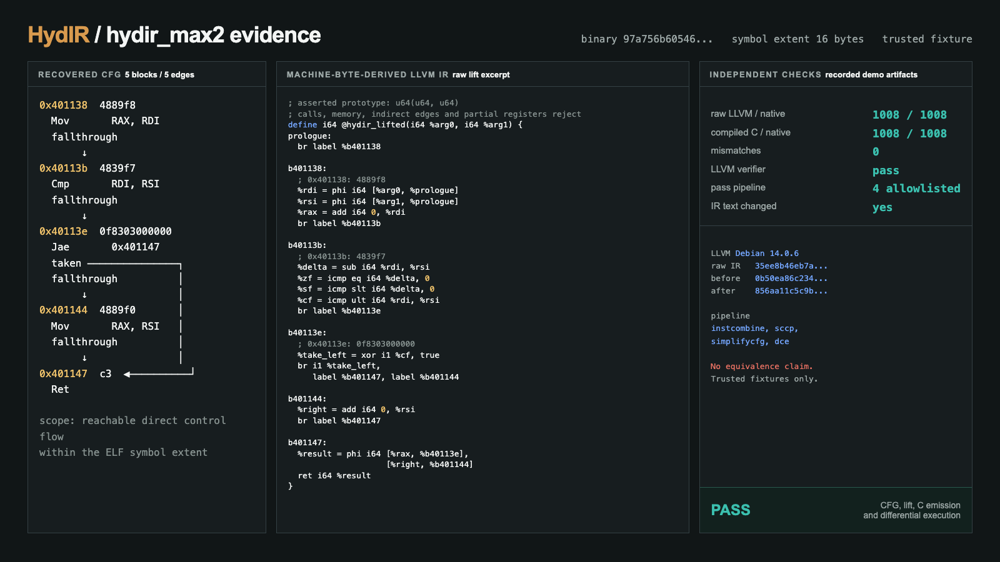
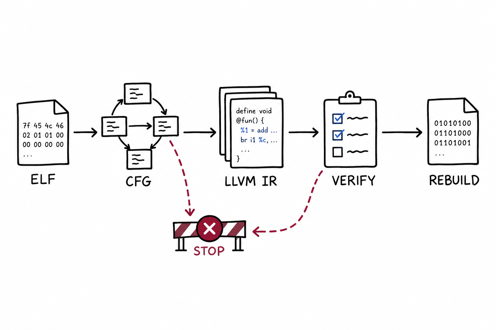

<h1 align="center">HydIR</h1>

<p align="center">
  <strong>A native workbench for inspecting, lifting, testing, and rebuilding a bounded x86-64 ELF subset.</strong><br>
  Local by default, explicit about uncertainty, and designed around inspectable artifacts.
</p>

<p align="center">
  
  
  <a href="LICENSE"></a>
</p>

<p align="center">
  <a href="#quick-start">Quick start</a> ·
  <a href="#native-analysis-workbench">Workbench</a> ·
  <a href="#verified-scalar-lift">Evidence</a> ·
  <a href="#capability-map">Capabilities</a> ·
  <a href="#exact-lift-contract">Contract</a> ·
  <a href="#project-layout">Layout</a>
</p>

[](assets/evidence/max2-evidence.png)

HydIR opens little-endian x86-64 ELF files without uploading them. The current native slice recovers bounded control flow, emits LLVM IR and scalar C for a deliberately small instruction set, runs differential checks against trusted fixtures, and exposes the same core through a desktop app, CLI, Python SDK, and authenticated loopback service.

This is an engineering workbench, not a general decompiler. Unsupported instructions, memory behavior, calls, partial registers, and ambiguous recovery paths stop the lift instead of being guessed.

## Quick start

Rust 1.96 is pinned in [`rust-toolchain.toml`](rust-toolchain.toml), and [`Cargo.lock`](Cargo.lock) fixes the Rust dependency graph.

```bash
cargo test --locked --workspace
cargo run --locked --bin hydir
```

Open a local binary directly:

```bash
cargo run --locked --bin hydir -- \
  --open-local /path/to/program.elf function_name
```

Or inspect it from the CLI:

```bash
cargo run --locked --bin hydirctl -- inspect /path/to/program.elf
cargo run --locked --bin hydirctl -- cfg /path/to/program.elf function_name
cargo run --locked --bin hydirctl -- lift \
  /path/to/program.elf function_name \
  --assume-u64x2 --output lifted.ll
```

Clang with x86-64 ELF and LLVM IR support is required for the full demo path. Native execution comparisons require Linux x86-64. On macOS with Docker Desktop:

```bash
bash scripts/demo-linux-docker.sh
```

## Native analysis workbench

[](assets/screenshots/studio-analyst-annotations.png)

The desktop workbench keeps the program tree, analysis views, inspector, and diagnostics visible at once. It can:

- disassemble executable sections with recursive recovery from symbols and entry points
- show uncertain linear-sweep regions and undecodable gaps instead of silently promoting them to functions
- inspect CFG, LLVM IR, scalar C, named pass results, and conservative global effects
- save local names, comments, assumptions, and pane layout in a private SQLite project
- create an authenticated loopback project only through an explicit transfer action
- apply bounded transforms, rebuilds, and scalar patches to new output paths

Opening a local ELF does not upload it. Credentials are not persisted, remote projects do not reconnect automatically, and the service refuses non-loopback binding.

## Verified scalar lift

The checked demo path covers 20 distinct scalar functions. Each function is lifted to LLVM IR and C, verified where the required LLVM tools are available, then compared with native execution on 1,008 inputs per output path.

```bash
bash scripts/demo-local.sh
bash scripts/demo-corpus.sh
```

The primary fixture image above shows the complete evidence chain for `hydir_max2`: recovered blocks and edges, machine-byte-derived IR, verifier status, and differential results. These checks establish the documented subset only. They do not prove equivalence for arbitrary programs.

## Recovery pipeline

[](blog/assets/hydir-pipeline.png)

HydIR carries explicit boundaries through the pipeline. A valid import can still fail CFG recovery; a valid CFG can still fail lifting; valid LLVM IR can still fall outside the rebuild contract. Rebuild output is always written as a new artifact.

## Capability map

| Surface | Current scope | Entry point |
|---|---|---|
| Desktop | Local ELF inspection, projects, annotations, CFG, lift, C, passes, effects, patch and rebuild flows | `cargo run --bin hydir` |
| CLI | Local inspection plus authenticated loopback operations | `hydirctl` |
| Native lift | Bounded scalar x86-64 function subset | `hydirctl lift` |
| Scalar C | Conservative C for the same accepted function contract | `hydirctl decompile` |
| Whole rebuild | Trusted static freestanding fixtures with bounded memory and syscall support | `hydirctl rebuild` |
| Scalar patch | Entry-only whole-function replacement with explicit assertions | `hydirctl patch` |
| Python | Typed client for the authenticated loopback subset | [`sdk/python`](sdk/python/README.md) |
| Symbolic bridge | Bounded x86-64 function expressions and a restricted REPL | `hydirctl triton` |

Useful end-to-end demos:

```bash
bash scripts/demo-password-showcase.sh
bash scripts/demo-analysis.sh
bash scripts/demo-passes.sh
bash scripts/demo-recompile.sh
bash scripts/demo-patch.sh
bash scripts/demo-remote.sh
```

Each script creates a fresh run directory under `target/` and keeps reports beside the generated artifacts.

## Exact lift contract

- **Input:** little-endian x86-64 ELF with a nonzero text symbol. Stripped input requires an explicit virtual entry and byte extent.
- **ABI assertion:** `--assume-u64x2` declares `u64(u64, u64)` under SysV AMD64. HydIR does not infer that prototype.
- **Instructions:** full-width scalar `mov`, non-RIP-relative `lea`, `add`, `sub`, `cmp`, `test`, `nop`, `ret`, direct `jmp`, and direct integer conditional branches.
- **Registers:** RAX, RDI, RSI, RDX, and RCX. Inputs begin in RDI and RSI; every returning path must define RAX.
- **Flags:** ZF, SF, OF, and CF for accepted arithmetic and branches.
- **Control flow:** direct branches must stay inside the selected extent and land on non-overlapping instruction boundaries.
- **Refusals:** unknown semantics, memory access, calls, indirect edges, partial registers, or uninitialized reads on any recovered path.
- **Outputs:** new files only, except that byte-identical existing content is accepted.

Import is intentionally broader than lift. A function that can be inspected is not automatically liftable, and a liftable function is not automatically eligible for whole-executable rebuild.

## Safety boundaries

`hydirctl validate` executes the original trusted fixture and its lifted runner without a hostile-input sandbox. It requires `--trusted-fixture`; never use it with an unknown binary.

The local service has no remote execution endpoint. Whole-executable rebuild is limited to the documented static freestanding fixture subset and rejects code outside its instruction, memory, and OS contract.

The symbolic console accepts one statement at a time from a restricted Python-shaped language. It exposes bounded register, instruction, expression, model, `print`, integer `hex`, and xor operations. It does not expose the filesystem, shell, network, arbitrary imports, or general Python execution.

## Project layout

| Path | Purpose |
|---|---|
| [`crates/hydir-backend`](crates/hydir-backend) | ELF import, disassembly, CFG recovery, and LLVM lifting |
| [`crates/hydir-gui`](crates/hydir-gui) | Native egui workbench |
| [`crates/hydir-cli`](crates/hydir-cli) | Local and loopback command-line interface |
| [`crates/hydir-server`](crates/hydir-server) | Authenticated loopback service and durable jobs |
| [`crates/hydir-project`](crates/hydir-project) | Local revisioned project storage |
| [`crates/hydir-analysis`](crates/hydir-analysis) | Conservative program analysis |
| [`crates/hydir-c`](crates/hydir-c) | Scalar C emission |
| [`crates/hydir-transform`](crates/hydir-transform) | Allowlisted LLVM pass experiments |
| [`crates/hydir-recompile`](crates/hydir-recompile) | Bounded whole-executable rebuild |
| [`crates/hydir-patch`](crates/hydir-patch) | Scalar patch format and validation |
| [`sdk/python`](sdk/python) | Python client, examples, and tests |
| [`scripts`](scripts) | Reproducible demos and integration gates |

## License

HydIR is released under the [GNU Affero General Public License v3.0 only](LICENSE).
