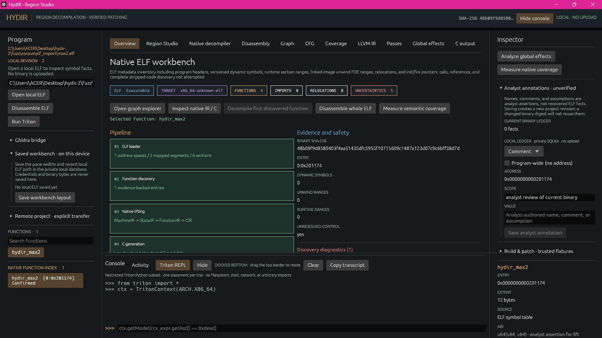
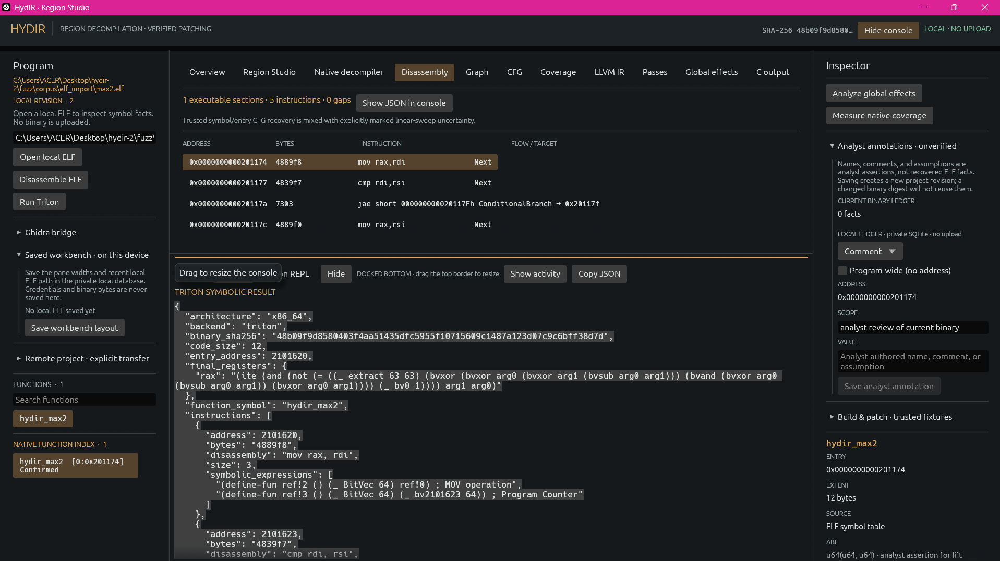

# HydIR


Binary lifting and analysis in Rust.
Machine code goes in; source-linked P-code, state effects, and inspectable artifacts come out.

[Run it](#run-it) · [Workbench](#workbench) · [Docs](https://hydir.wiki/guides) · [Articles](https://hydir.wiki/blogs) · [Architecture](https://hydir.wiki/architecture)

HydIR uses Ghidra to analyze x86-64 ELF binaries and imports raw P-code into its Rust analysis core. A separate native pipeline produces disassembly, control-flow graphs, SSA, and C output. The desktop workbench, CLI, Python SDK, and authenticated service expose these artifacts with their provenance, coverage, and unresolved effects.

<br clear="right">

## Run it

With **Rust 1.96+**, clone the repository and open the included PRISM demo:

```bash
git clone https://github.com/Achxy/hydir-2.git
cd hydir-2
cargo run --locked --bin hydirctl -- doctor
cargo run --locked --bin hydir -- --open-local demo/hydir-prism.elf hydir_stage_decision
```

The workbench opens the demo at a branching function. The Ghidra-backed workflow provisions a pinned container on first analysis; the [first-run guide](https://hydir.wiki/docs/first-run) covers setup and expected output.

For a smaller native CLI example:

```bash
cargo run --locked --bin hydirctl -- discover fuzz/corpus/elf_import/max2.elf
cargo run --locked --bin hydirctl -- decompile fuzz/corpus/elf_import/max2.elf --function hydir_max2 --view unit
```

## Workbench

[](https://hydir.wiki/docs/desktop)

The desktop keeps function navigation, disassembly, control flow, P-code, state effects, and C views together. Analyst facts and typed models help refine the output while retaining the evidence behind it.

| Workflow | What you can inspect |
| :--- | :--- |
| Ghidra lifting | Source-linked raw P-code, ordered effects, concrete traces, and bounded LLVM exports |
| Native analysis | ELF inventory, function discovery, machine effects, SSA, and low-level or structured C |
| Behavior exploration | Frida observations, captured-state replay, and optional Triton symbolic exploration |
| Automation | Local and remote artifacts through the CLI, Python SDK, and revisioned service APIs |

Unsupported operations and unknown targets remain explicit. Verification applies to the declared operation subset and recorded model; whole-function executable P-code lifting remains in progress. See [features and limits](https://hydir.wiki/features) for the current scope.

## Symbolic exploration

[](https://hydir.wiki/docs/symbolic)

Triton exposes symbolic expressions, path conditions, and candidate inputs for a selected function. It requires an optional Python dependency; explored paths do not establish whole-program equivalence.

## Documentation

Setup, commands, contracts, and worked examples live on [hydir.wiki](https://hydir.wiki/).

- [First run](https://hydir.wiki/docs/first-run) · [Desktop](https://hydir.wiki/docs/desktop) · [Native analysis](https://hydir.wiki/docs/native-analysis)
- [Ghidra](https://hydir.wiki/docs/ghidra) · [Frida](https://hydir.wiki/docs/frida) · [Triton](https://hydir.wiki/docs/symbolic)
- [Python SDK](https://hydir.wiki/docs/python-sdk) · [Service](https://hydir.wiki/docs/service) · [Typed models](https://hydir.wiki/docs/models)
- [Technical articles](https://hydir.wiki/blogs) · [Architecture](https://hydir.wiki/architecture)

## Citation

If you use HydIR in your work, cite it using [CITATION.cff](CITATION.cff) or:

```bibtex
@software{jayadevan_u_2026_hydir,
  author  = {Achyuth Jayadevan and Siddharth U},
  title   = {HydIR: Ghidra-backed and native binary lifting, analysis, and decompilation in Rust},
  year    = {2026},
  version = {0.1.0},
  url     = {https://github.com/Achxy/hydir-2}
}
```

## License

[GNU Affero General Public License v3.0 only](LICENSE).
