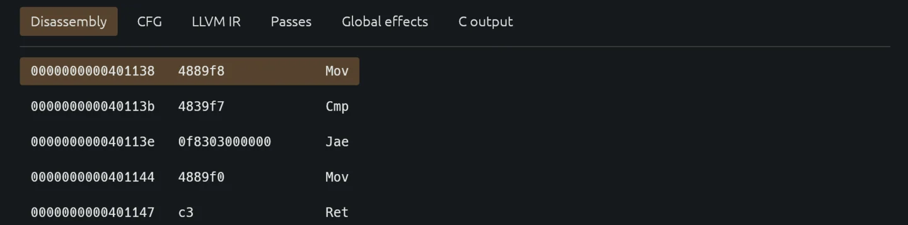
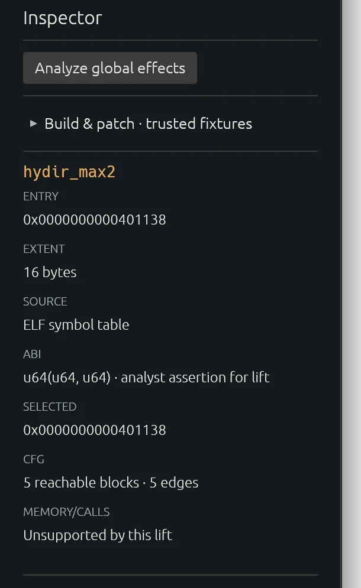
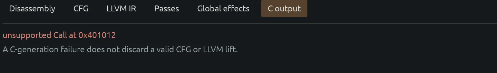

# Native analysis workbench

The `hydir` desktop application presents the program tree, analysis panes,
inspector, and diagnostics in one workbench. Open an ELF with the local file
control or `--open-local <elf> [function-symbol]`. Local opening reads the file
on the host; transfer to an authenticated service requires the separate,
explicit upload action.

The program tree includes symbolized and anonymous FunctionIndex entries.
Selecting one reveals its entry and extent evidence, reachable disassembly,
machine bytes, CFG, and available native MachineIR, StateIR, FunctionIR, CIR,
low-level C, structured C, and diagnostics. The workbench also exposes the
legacy scalar LLVM/C path, named pass experiments, and conservative global
effects. Linear-sweep candidates, undecodable gaps, and unresolved branches
remain marked as uncertain instead of becoming confirmed functions.

Local names, comments, and assumptions are analyst facts with a scope and
binary identity; they do not become machine-derived evidence. A private SQLite
store retains these facts, pane widths, and the recent local path. It does not
persist credentials, binary bytes, or a remote session. Remote artifacts are
checked against their project revision and digest before presentation. Local
and remote pass, rebuild, and scalar-patch controls use the same bounded
contracts as the CLI and write new output paths.

## GUI screenshots

The overview at the top of this README shows the loaded ELF and native pipeline
status. The following captures show individual analysis views of the desktop
application.

**Disassembly.** Recovered instructions retain their addresses, original
machine bytes, and decoded operations.

**Function inspector.** The selected function's entry, byte extent, ELF symbol
source, asserted ABI, and reachable CFG size appear beside the analysis views.

**C output and diagnostics.** The GUI reports an unsupported call explicitly
while retaining the independently recovered CFG and LLVM lift.

Remote projects do not reconnect automatically. Plaintext service connections
remain loopback-only; non-loopback connections require TLS.
