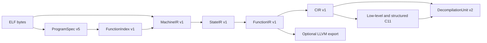
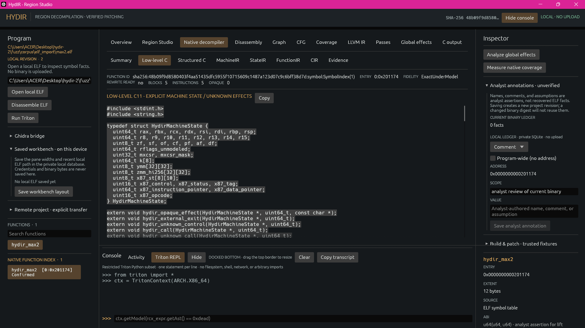

# Native ELF decompiler

The native path analyzes bounded, compiler-generated Linux x86-64 ELF files.
It does not execute the input or invoke Ghidra or another external decompiler.
Versioned intermediate artifacts retain the binary SHA-256, machine
locations, evidence, and uncertainties needed to inspect their output. The
implementation record contains the full
instruction inventory and outstanding release gates.

## Pipeline and artifact contracts



| Stage | Contract and output |
| --- | --- |
| ELF import | `hydir-loader` creates a digest-bound `ProgramSpec` with file type, target and ABI, sections, mapped segments, program headers, symbols, imports, relocations, runtime ranges, and explicit recovery status. Linked files use process-image address space zero; relocatable sections have distinct address spaces. A PIE address is recorded without asserting its runtime load bias. |
| Discovery | `FunctionIndex` records an entry, stable ID, optional name, evidence state (`confirmed`, `probable`, or `ambiguous`), candidate extents, block entries, control targets, tail-call evidence, and unresolved conflicts. An index row is a candidate, not proof that every byte in its extent belongs to the function. |
| MachineIR | Recursive decoding records each instruction's address, original bytes, operands, decorators, register/flag/memory effects, and typed control edges. Relocated control operands use ELF relocation evidence rather than encoded linker placeholders. Unknown operations retain bounded `OpaqueEffect` footprints. |
| StateIR | Component-level SSA versions registers, modeled flags, control, and stack/image/TLS/heap/unknown memory regions. Predecessor versions and phis represent joins and loop backedges; a store consumes and defines its memory region. Architecturally undefined flags remain explicit outputs. |
| FunctionIR | Adds evidenced SysV AMD64 parameters and returns, calls, stack and global objects, pointer origins, alias sets, and diagnostics to the state flow. An inferred type or prototype is labeled with its evidence. |
| CIR and C | CIR preserves operations, opaque effects, and explicit terminators before emitting deterministic low-level C11. A separate structurer emits C for supported control shapes; remaining regions retain labels and gotos. LLVM is an optional FunctionIR export and is not the input to native C generation. |
| DecompilationUnit | Version 2 bundles C views, artifact digests, statement provenance, diagnostics, and independent structural, semantic, verification, and rewrite-readiness claims. Older ProgramSpec v1-v4 and DecompilationUnit v1 files are read through in-memory compatibility migrations; reading them does not upgrade their evidence. |

The native IRs distinguish `partial` from `complete` control-flow recovery,
`unknown`/`conservative` from `exact_under_model` semantics, and `not_run` from
static or differential verification. Exactness is relative to the recorded
machine and environment model; it is not a claim of whole-program equivalence.
The native path currently sets `rewrite_ready` to false, including when it can
emit C. Legacy scalar patch and rebuild operations require their own explicit
proofs and assertions.

## ELF loading and function discovery

The loader accepts linked executables, PIE/shared objects, stripped images,
and relocatable ELF objects. It inventories static and GNU-versioned dynamic
symbols; program headers; PLT, GOT, TLS, and unwind ranges; init/fini pointer
arrays; and relocations. Bounded `.eh_frame` CIE/FDE decoding contributes
function entry and extent evidence. Resolved init/fini pointers add probable
entries; unresolved pointers remain recorded. For relocatable objects,
section-relative identity and relocation-resolved control targets are retained.
Defined Itanium RTTI, type-info, vtable, construction-vtable, and VTT symbols
are recorded as bounded metadata ranges rather than promoted to recovered
source types.

Discovery combines symbol, ELF entry, unwind, direct-call, decoded PLT-stub,
init/fini, and Go 1.18+ `.gopclntab` evidence. Rust, C++, and Go symbol
spellings are retained as language evidence without inferring a source-level
signature from a name alone. Standard PLT slots can receive imported names
when relocation order supports the match. Candidate branch targets and
possible terminal-branch tail calls stay separate from confirmed call facts.
Recursive block recovery stops at known entries or its size bound. Absolute
pointer tables and relocation-backed relative tables can add indirect CFG
targets; recovery iterates when a newly reached block exposes another table.
An unresolved switch default or indirect destination remains visible.

The implementation bounds ELF input to 64 MiB, an extracted function to
64 KiB, and a function decode to 16,384 instructions. Discovery retains at
most 16,384 candidate entries. Explicit `discover` enriches block membership
for at most 256 candidates under an 8 MiB decode budget; interactive selection
can decode a chosen candidate lazily. Exceeding a bound produces a diagnostic
or explicit refusal rather than silently treating omitted bytes as analyzed.

## Instruction and state semantics

| Family | Modeled behavior and boundary |
| --- | --- |
| Scalar integer and control | Width-aware moves, extension, arithmetic, ADC/SBB, comparisons, conditional moves and sets, LEA, shifts/rotates including BMI2 forms, bit counts/scans/tests, multiplication, and signed/unsigned divide normal paths. Partial registers, PF/AF/DF, and undefined results or flags have explicit state effects. Divide errors retain exception edges. |
| Stack, strings, and calls | Common stack operations and DF-aware MOVS/STOS/CMPS/SCAS with REP variants update implicit registers and flags. Direct, indirect, and tail-call evidence is retained. REP results remain conservative where interruption or fault-time partial progress is unresolved. |
| SIMD and floating point | Alias-aware XMM/YMM/ZMM state; supported SSE/AVX/AVX2 moves, integer lanes, shuffles, broadcasts, AESENC, scalar/packed arithmetic, conversions, and comparisons; selected AVX-512 bitwise, packed-floating, move, mask, permutation, popcount, GFNI, qword comparison, and compression forms. MXCSR-aware helpers model normal paths with explicit unresolved exception edges. Aligned accesses retain alignment-fault edges; masked memory accesses touch only active elements. Unsupported EVEX decorators remain conservative. |
| Atomics and ordering | Supported LOCK arithmetic, exchange, compare-exchange (including 8/16-byte forms), bit modification, and LFENCE/SFENCE/MFENCE use bounded helper contracts. Other atomic forms retain a conservative memory and register footprint. |
| x87 and extended state | Common 80-bit stack arithmetic, comparisons, conversions, transcendental operations, and environment/state-image save/restore use explicit x87 registers and control/status/tag state. FXSAVE/FXRSTOR and MXCSR transfers have a bounded legacy image. Dynamic XSAVE/XRSTOR-family layouts retain request-mask, XCR0/XSS, memory-direction, state, and exception effects without inventing component offsets. |
| System and environment | CPUID, time counters, XCR access, and hardware randomness have bounded environment-helper effects; analysis does not execute them. Linux `syscall` remains opaque but records ABI inputs, clobbers, unknown-memory effects, and control flow so wrapper analysis can continue. |

For an unsupported instruction, the decoder retains its bytes, address,
known architectural read/write footprint, and a diagnostic. The unknown
behavior is carried through subsequent IRs and emitted as a visible helper
call in low-level C. This allows a compilable diagnostic view without
claiming that the function's behavior was recovered exactly.

## ABI recovery and C generation

FunctionIR starts with SysV AMD64 register and stack locations. It recovers
integer and evidenced pointer inputs, XMM/YMM inputs, RAX:RDX and vector
returns, and scalar or packed floating types only when evidence is unique.
Audited version-aware libc, POSIX, pthread, and loader prototypes can supply
fixed argument/result locations, variadic markers, and `noreturn` facts for
external calls. Unknown indirect targets, aliases, and call effects remain
conservative. Entry-RSP stack normalization handles common frame-pointer and
frame-pointer-omitted prologues; accesses stay raw where a join or dynamic
stack change prevents a proof.

Low-level C11 uses explicit machine state, memory helpers, labels, and
opaque-effect helpers. The structured view handles straight-line code,
nested acyclic `if`/`else`, guarded jump-table `switch`, and proven pre-tested
or post-tested single-loop shapes. Other reducible or irreducible control flow
keeps explicit labels and gotos. A structured view is optional; if unavailable,
`--view structured` reports that condition while `--view low` and `--view unit`
remain available. C compilation establishes syntax and type consistency for
the helper contract; it does not establish behavioral equivalence.

[](../../../assets/screenshots/hydir-low-level-c.png)

*The Low-level C view displays generated helper contracts alongside the artifact's fidelity and rewrite-readiness claims. The displayed C is an inspectable analysis output, not a verified replacement for the input function.*

## Native CLI and evidence

The local CLI exposes the intermediate stages and reports directly:

```bash
cargo run --locked --bin hydirctl -- lift program.elf --function symbol --ir machine
cargo run --locked --bin hydirctl -- lift program.elf --function symbol --ir function
cargo run --locked --bin hydirctl -- lift program.elf --function symbol --ir cir
cargo run --locked --bin hydirctl -- lift program.elf --function symbol --ir llvm
cargo run --locked --bin hydirctl -- decompile program.elf --function symbol --view low
cargo run --locked --bin hydirctl -- decompile program.elf --function symbol --view structured
cargo run --locked --bin hydirctl -- coverage program.elf
cargo run --locked --bin hydirctl -- explain program.elf --function symbol --address 0x401000
cargo run --locked --bin hydirctl -- decompile-all program.elf --output-dir new-output-directory
```

`--function` accepts an unambiguous name or a FunctionIndex ID. `explain`
reports recovered instruction effects and diagnostics, optionally narrowed to
one address. `coverage` counts exact and opaque instruction occurrences by
family and includes bounded opaque-site samples. `decompile-all` requires a
new output directory and refuses to merge with or overwrite an existing one.

On the pinned stripped Go fixture, a whole-file pass lifted 1,481 pclntab
functions with 116,592 exact and 37 opaque instruction occurrences (99.968%
exact for that fixture). All 1,481 low-level C views and 165 structured views
strict-compiled to objects. This is fixture evidence, not a broad-corpus or
differential-correctness result. On Linux x86-64,
`bash scripts/demo-native-decompiler.sh` checks discovery, deterministic batch
emission, and strict C compilation. Dedicated native-pipeline and IR JSON
fuzz targets check crashes and refusals; a manual/weekly real-ELF stress
workflow exercises the stripped Go fixture. See the
remaining gates.
