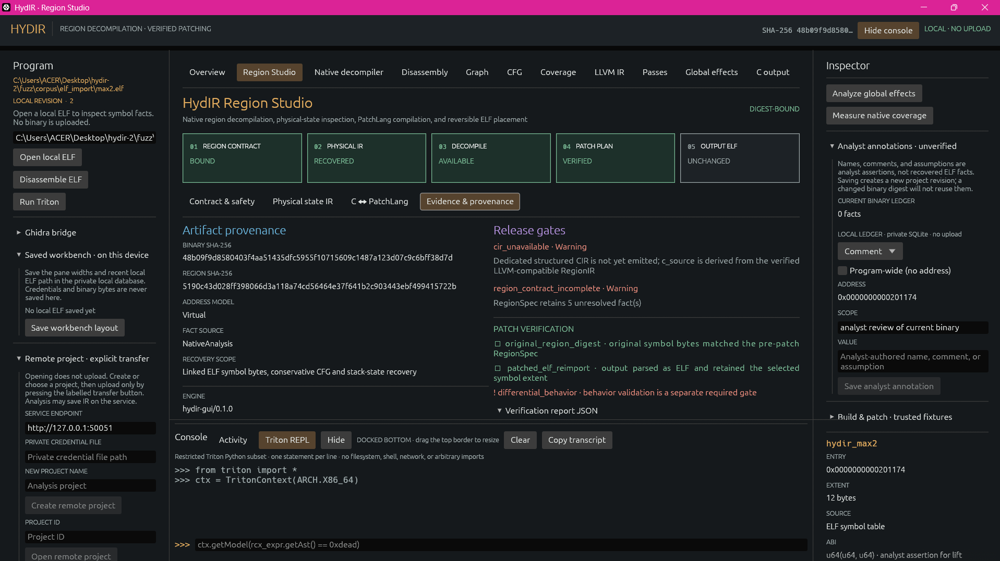

# Analysis, transformation, and rewrite contracts

The following operations are separate from native decompilation. Each has its
own supported input subset, output artifact, and acceptance conditions.

| Operation | Input and result | Required boundary |
| --- | --- | --- |
| Global effects | `analyze` and `analyze-spec` recover bounded direct-call and mapped-global read/write evidence, with provenance in the report and ProgramSpec. Unresolved calls or memory effects remain conservative. | This is a partial interprocedural analysis, not a complete call graph or alias proof. |
| LLVM pass experiment | The legacy scalar lift is passed to LLVM 14 with a sequence of at most four unique names from `instcombine`, `sccp`, `simplifycfg`, and `dce`. The operation saves raw, canonical-before, after, report, and digest evidence. | Requires an asserted scalar prototype and trusted fixture; LLVM verification does not establish equivalent behavior. Remote experiments create a new immutable revision while retaining the original ELF bytes. |
| Scalar patch | A versioned JSON document binds the source ELF SHA-256, sized `.text` symbol, asserted `u64(u64,u64)` prototype, and C-like return expression. Compilation checks the original scalar lift, region bytes, exits, stack restoration, interior-entry evidence, and relocations. A `PatchBundle` records typed PatchIR, byte differences, placement, hashes, and structural verification. | Requires explicit trusted-fixture, prototype, and entry-only assertions. A fitting replacement is written in place within a new ELF copy; a larger supported replacement uses an entry jump into a new executable segment. Neither path overwrites the original or claims behavioral verification. |
| Whole-executable rebuild | The separate freestanding path lifts a static ELF with sized `_start` and complete, non-overlapping `.text` symbol coverage into stateful LLVM IR, then links a bounded read/write/exit runtime. It emits a new ELF, IR, and report. | Requires direct control flow, supported instructions, definite state initialization, and a bounded data image. Stack accesses, indirect edges, and unsupported syscalls are refused. This worker is not an arbitrary-binary sandbox. |

[](../../../assets/screenshots/hydir-region-provenance.png)

*Region Studio keeps source provenance, patch verification checks, release-gate warnings, and analyst annotations visible with the selected region. Warnings identify unmet conditions; they do not constitute approval to rewrite the binary.*

The scalar patch document has this minimal form; the digest must match the
input ELF exactly:

```json
{
  "schema_version": 1,
  "binary_sha256": "<64 lowercase hexadecimal characters>",
  "function_symbol": "hydir_max2",
  "prototype": "u64(u64,u64)",
  "replacement": "return arg0 - arg1;"
}
```

For local operations, the corresponding commands are:

```bash
cargo run --locked --bin hydirctl -- analyze program.elf
cargo run --locked --bin hydirctl -- analyze-spec program.elf
cargo run --locked --bin hydirctl -- transform program.elf symbol --assume-u64x2 --trusted-fixture --passes instcombine,sccp --output-dir new-pass-directory
cargo run --locked --bin hydirctl -- patch program.elf patch.json --trusted-fixture --assume-u64x2 --assume-entry-only --output patched.elf
cargo run --locked --bin hydirctl -- rebuild program.elf --trusted-fixture --output-dir new-rebuild-directory
```

The patch output is a separate ELF and can be reverted using its matching
bundle when the recorded byte and hash checks pass. Remote mutations require
the current project revision and an idempotency key; the service does not
execute the result.

## HydIR interchange and region contracts

HydIR owns its protobuf contracts under the `hydir.interchange` and
`hydir.patch` namespaces. The interchange importer retains the original
protobuf bytes for lossless forwarding, including fields unknown to the
decoded view. Decoding limits the document to 64 MiB, 8,192 functions,
65,536 blocks, 4,096 memory ranges, 65,536 symbols and call sites each,
4,096-byte names, and a type nesting depth of 64; individual value and type
graphs have separate node budgets. The streaming convention uses bounded
2,000,000-byte chunks. A decoded specification is bound to matching ELF bytes
before a selected block can become RegionSpec v3:

```bash
cargo run --locked --bin hydirctl -- hydir-spec-inspect program.proto
cargo run --locked --bin hydirctl -- hydir-spec-region \
  program.proto program.elf 26 --output region.json
cargo run --locked --bin hydirctl -- hydir-spec-lift \
  program.proto program.elf 26 --output physical-region-ir.json
cargo run --locked --bin hydirctl -- hydir-spec-decompile \
  program.proto program.elf 35 --output decompilation-unit.json
cargo run --locked --bin hydirctl -- hydir-spec-report \
  program.proto program.elf
```

`hydir-spec-inspect` validates the bounded document; `hydir-spec-region`
constructs the selected CFG contract; `hydir-spec-lift` emits
`PhysicalRegionIR` v1; `hydir-spec-decompile` requests a unit only where its
proof obligations hold; and `hydir-spec-report` summarizes compatibility.
`PhysicalRegionIR` v1 covers every instruction in the pinned 23-region corpus.
It records typed operations and operands, exact successors, register/flag and
memory effects, physical boundary locations, stack deltas, unresolved facts,
and byte/digest provenance. Decoding alone does not imply lowering or
replacement safety. The narrower structured-decision form binds imported flag
inputs, both exact continuations, and unchanged live outputs before emitting
LLVM-compatible text and deterministic C.

The local server mounts the interchange and patch services and accepts the
bounded streaming convention. For non-empty programs it currently returns a
precondition error where physical adapters are incomplete; it does not
fabricate C or PatchIR. The pinned external reference repository is a
test-only submodule and is not linked into HydIR:

```bash
git submodule update --init third_party/hydir-reference
```

The current compatibility boundary is recorded in
ADR 0018. The native
decompiler's remaining gates are listed in the
implementation record.
